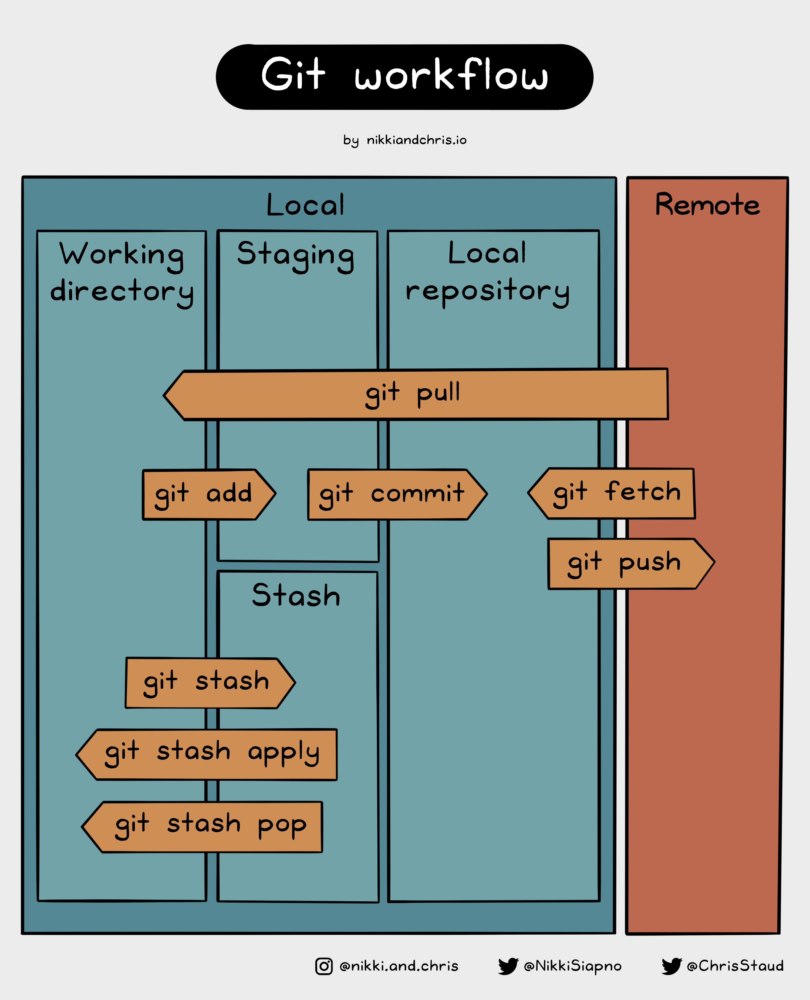
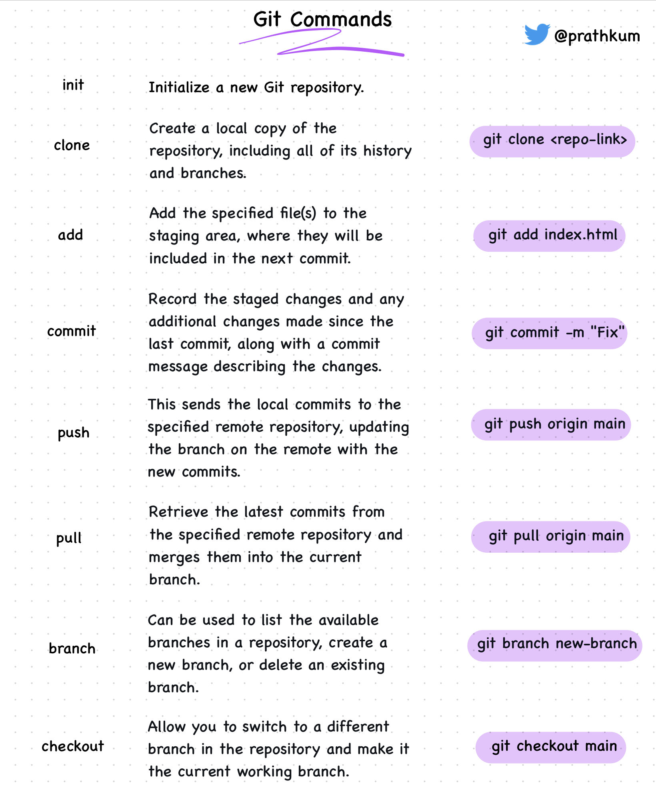
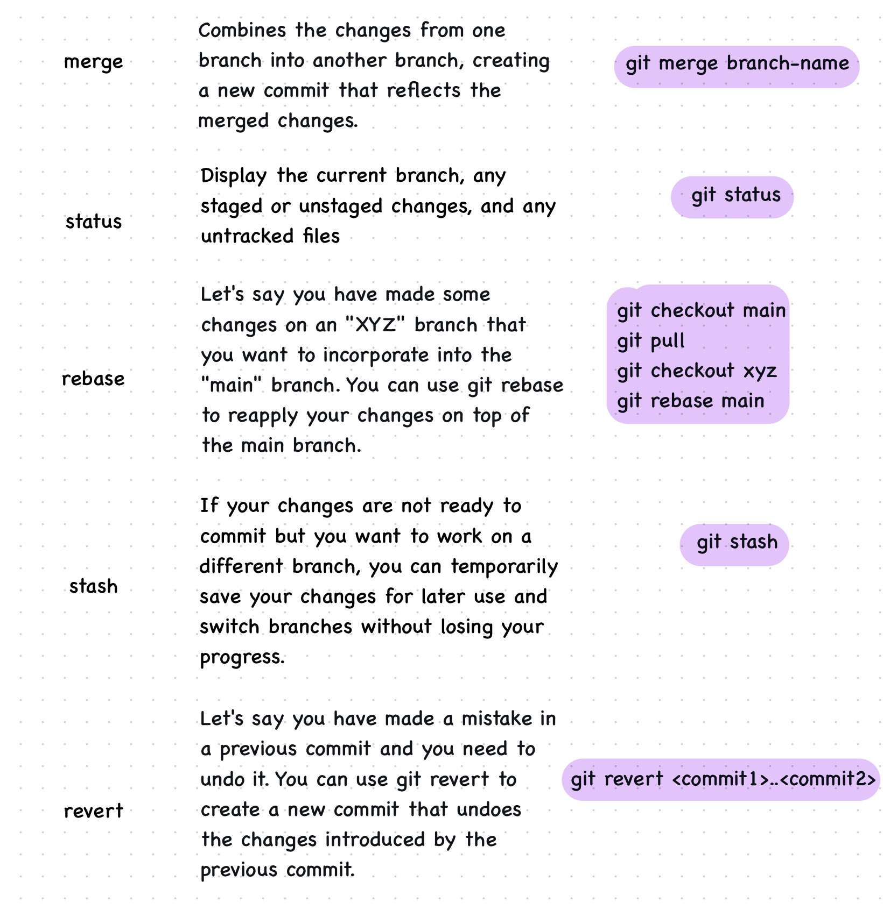

# Git and GitHub Session Notes

git was created by Linus Torvalds, the creator of Linux, when there was
a need for free and open-source version control system for development
of linux source tree. GitHub is, as its name implies, a hub of git
repositories, or "repo(s)"

Introducing terms:

-   Version Control (Distributed Version Control System) -- tracking
    changes, collaboration and rollback changes
-   Repository -- collection of project files, code base

## Git Bash Installation

-   Git Bash installation from
    [https://git-scm.com/download/win](https://git-scm.com/download/win)
    installation will give git as well as git bash

## Create account and setup SSH

Create account and setup connection with SSH to GitHub (using Git Bash):

-   Generate Public/Private Key Pair
    `ssh-keygen -t ed25519 -C "your_email@example.com"`
    or
    `ssh-keygen -t rsa -b 4096 -C "your_email@example.com"`
-   Start SSH agent in background
    `eval "$(ssh-agent -s)"`
-   Add generated key to the agent
    `ssh-add ~/.ssh/id_ed25519`
-   Add public key to GitHub settings (`Settings > SSH and GPG keys > Add`)
    `~/.ssh/id_ed25519.pub`
-   Test connection
    `ssh -T git@github.com`
-   Add to `~/.bashrc` in Git Bash

```bash
eval "$(ssh-agent -s)"
ssh-add ~/.ssh/id_ed25519
```

or from GitHub documentation:

```bash
env=~/.ssh/agent.env

agent_load_env () { test -f "$env" && . "$env" >| /dev/null ; }

agent_start () {
    (umask 077; ssh-agent >| "$env")
    . "$env" >| /dev/null ; }

agent_load_env

# agent_run_state: 0=agent running w/ key; 1=agent w/o key; 2=agent not running
agent_run_state=$(ssh-add -l >| /dev/null 2>&1; echo $?)

if [ ! "$SSH_AUTH_SOCK" ] || [ $agent_run_state = 2 ]; then
    agent_start
    ssh-add
elif [ "$SSH_AUTH_SOCK" ] && [ $agent_run_state = 1 ]; then
    ssh-add
fi

unset env
```

## Basic Workflow and Commands

Most important commands are init, add, status, commit, push, pull, branch

Workflow
(Credit to [@NikkiSiapno on Twitter](https://twitter.com/NikkiSiapno/)):



Cheatsheet
(Credit to [@Prathkum on Twitter](https://twitter.com/Prathkum)):




## GitHub Git Cheatsheet

[git cheatsheet by GitHub](https://education.github.com/git-cheat-sheet-education.pdf)
